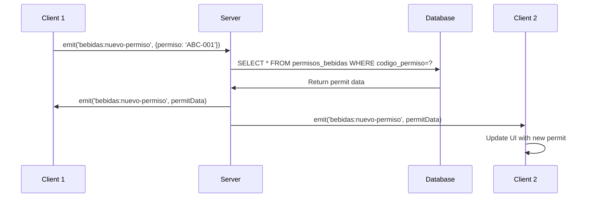

## Overview

The application uses **Socket.io v4.4.1** to provide real-time updates across all connected clients when permits are created, edited, approved, or cancelled. This ensures all users see changes immediately without requiring page refreshes.

## Server Setup

Socket.io is initialized alongside the Express server:

```javascript
const SocketIO = require('socket.io'),
  io = SocketIO(server);

io.on('connection', (socket) => {
  console.log('¡Se ha detectado una conexión!', socket.id);
  
  // Event handlers registered here...
});
```

*Source: src/index.js:86-92*

## Event Categories

Events are organized by permit type with consistent naming patterns:

<CardGroup cols={3}>
  <Card title="Bebidas" icon="wine-glass">
    Alcohol sales permits
  </Card>
  
  <Card title="Eventos" icon="calendar">
    Special event permits
  </Card>
  
  <Card title="Publicidad" icon="bullhorn">
    Advertising permits
  </Card>
</CardGroup>

Each category supports the same event types:
- `nuevo-permiso`: New permit created
- `edit-permiso`: Permit edited
- `aprobate-permiso`: Permit approved
- `cancel-permiso`: Permit cancelled
- `delete`: Permit deleted

## Event Handlers

### Bebidas (Alcohol Permits)

#### New Permit Event

```javascript
socket.on('bebidas:nuevo-permiso', async (data) => {
  let pool = require('./database');
  
  await pool.query(
    'SELECT * FROM permisos_bebidas WHERE codigo_permiso=?', 
    [data.permiso], 
    (err, result, fields) => {
      if (err) {
        io.sockets.emit('bebidas:nuevo-permiso', err);
      } else {
        if (result.length > 0) {
          io.sockets.emit('bebidas:nuevo-permiso', result[0]);
        } else {
          io.sockets.emit('bebidas:nuevo-permiso', {
            errno: '¡NOT FOUND!',
            message: '¡Permiso no encontrado!',
            code: 'ERRPERMIT'
          });
        }
      }
    }
  );
  
  pool.end();
});
```

*Source: src/index.js:120-142*

<Accordion title="How It Works">
  1. Client emits `bebidas:nuevo-permiso` with `{ permiso: 'codigo' }`
  2. Server queries database for permit by code
  3. Server broadcasts full permit data to all clients
  4. All connected clients receive the new permit immediately
</Accordion>

#### Edit, Approve, and Cancel Events

These events use a reusable `socketEdit` helper function:

```javascript
function socketEdit(socketDirection, table) {
  socket.on(socketDirection, async (data) => {
    let pool = require('./database'),
        sql = 'SELECT * FROM ' + table + ' WHERE id=?';
    
    await pool.query(sql, [data.permiso], (err, result, fields) => {
      if (err) {
        io.sockets.emit(socketDirection, err);
      } else if (result.length > 0) {
        io.sockets.emit(socketDirection, {
          permiso: result[0],
          id: data.id
        });
      } else {
        io.sockets.emit(socketDirection, {
          errno: '¡NOT FOUND!',
          message: '¡Permiso no encontrado!',
          code: 'ERRPERMIT'
        });
      }
    });
    
    pool.end();
  });
}

// Usage:
socketEdit('bebidas:edit-permiso', 'permisos_bebidas');
socketEdit('bebidas:aprobate-permiso', 'permisos_bebidas');
socketEdit('bebidas:cancel-permiso', 'permisos_bebidas');
```

*Source: src/index.js:93-151*

#### Delete Event

```javascript
socket.on('bebidas:delete', (data) => {
  io.sockets.emit('bebidas:delete', data);
});
```

*Source: src/index.js:225-227*

<Note>
Delete events simply broadcast the received data without querying the database, as the deletion is handled by the route handler.
</Note>

### Eventos (Event Permits)

#### New Event Permit

```javascript
socket.on('eventos:nuevo-permiso', async (data) => {
  let pool = require('./database');
  
  await pool.query(
    'SELECT * FROM permisos_eventos WHERE codigo_permiso=?', 
    [data.permiso], 
    (err, result, fields) => {
      if (err) {
        io.sockets.emit('eventos:nuevo-permiso', err);
      } else {
        if (result.length > 0) {
          io.sockets.emit('eventos:nuevo-permiso', result[0]);
        } else {
          io.sockets.emit('eventos:nuevo-permiso', {
            errno: '¡NOT FOUND!',
            message: '¡Permiso no encontrado!',
            code: 'ERRPERMIT'
          });
        }
      }
    }
  );
  
  pool.end();
});
```

*Source: src/index.js:156-178*

#### Other Event Operations

```javascript
socketEdit('eventos:edit-permiso', 'permisos_eventos');
socketEdit('eventos:aprobate-permiso', 'permisos_eventos');
socketEdit('eventos:cancel-permiso', 'permisos_eventos');

socket.on('eventos:delete', (data) => {
  io.sockets.emit('eventos:delete', data);
});
```

*Source: src/index.js:181-187, 233-235*

### Publicidad (Advertising Permits)

#### New Advertising Permit

```javascript
socket.on('publicidad:nuevo-permiso', async (data) => {
  let pool = require('./database');
  
  await pool.query(
    'SELECT * FROM permisos_publicidad WHERE codigo_permiso=?', 
    [data.permiso], 
    (err, result, fields) => {
      if (err) {
        io.sockets.emit('publicidad:nuevo-permiso', err);
      } else {
        if (result.length > 0) {
          io.sockets.emit('publicidad:nuevo-permiso', result[0]);
        } else {
          io.sockets.emit('publicidad:nuevo-permiso', {
            errno: '¡NOT FOUND!',
            message: '¡Permiso no encontrado!',
            code: 'ERRPERMIT'
          });
        }
      }
    }
  );
  
  pool.end();
});
```

*Source: src/index.js:192-214*

#### Other Advertising Operations

```javascript
socketEdit('publicidad:edit-permiso', 'permisos_publicidad');
socketEdit('publicidad:aprobate-permiso', 'permisos_publicidad');
socketEdit('publicidad:cancel-permiso', 'permisos_publicidad');

socket.on('publicidad:delete', (data) => {
  io.sockets.emit('publicidad:delete', data);
});
```

*Source: src/index.js:217-223, 229-231*

## Event Payload Structures

### Client to Server

<CodeGroup>

```javascript New Permit
{
  permiso: 'codigo_permiso_value'
}
```

```javascript Edit/Approve/Cancel
{
  permiso: 123,  // ID of the permit
  id: 'element-id'  // DOM element ID for client updates
}
```

```javascript Delete
{
  id: 123  // ID of permit to delete
}
```

</CodeGroup>

### Server to Client

<CodeGroup>

```javascript Success (New Permit)
{
  id: 123,
  codigo_permiso: 'ABC-2024-001',
  habilitacion: '2024-01-01',
  vencimiento: '2024-12-31',
  requisitor_nombre: 'Juan',
  requisitor_apellido: 'Pérez',
  // ... all permit fields
}
```

```javascript Success (Edit/Approve/Cancel)
{
  permiso: {
    id: 123,
    codigo_permiso: 'ABC-2024-001',
    // ... all permit fields
  },
  id: 'element-id'
}
```

```javascript Error
{
  errno: '¡NOT FOUND!',
  message: '¡Permiso no encontrado!',
  code: 'ERRPERMIT'
}
```

```javascript Database Error
{
  errno: 1064,
  sqlMessage: 'You have an error in your SQL syntax...',
  code: 'ER_PARSE_ERROR'
}
```

</CodeGroup>

## Client Integration

Clients connect to Socket.io and listen for events:

```javascript
// Connect to Socket.io server
const socket = io();

// Listen for new permits
socket.on('bebidas:nuevo-permiso', (data) => {
  if (data.errno) {
    console.error('Error:', data.message);
  } else {
    // Add new permit to UI
    addPermitToTable(data);
  }
});

// Listen for permit updates
socket.on('bebidas:edit-permiso', (data) => {
  if (data.permiso) {
    updatePermitInTable(data.permiso, data.id);
  }
});

// Listen for deletions
socket.on('bebidas:delete', (data) => {
  removePermitFromTable(data.id);
});

// Emit events to server
socket.emit('bebidas:nuevo-permiso', { permiso: 'ABC-2024-001' });
```

## Event Flow Diagram



## Complete Event Reference

<AccordionGroup>
  <Accordion title="Bebidas Events">
    | Event | Payload (C→S) | Payload (S→C) |
    |-------|--------------|---------------|
    | `bebidas:nuevo-permiso` | `{permiso: codigo}` | Full permit object |
    | `bebidas:edit-permiso` | `{permiso: id, id: elementId}` | `{permiso: {...}, id: elementId}` |
    | `bebidas:aprobate-permiso` | `{permiso: id, id: elementId}` | `{permiso: {...}, id: elementId}` |
    | `bebidas:cancel-permiso` | `{permiso: id, id: elementId}` | `{permiso: {...}, id: elementId}` |
    | `bebidas:delete` | `{id: permitId}` | `{id: permitId}` |
  </Accordion>
  
  <Accordion title="Eventos Events">
    | Event | Payload (C→S) | Payload (S→C) |
    |-------|--------------|---------------|
    | `eventos:nuevo-permiso` | `{permiso: codigo}` | Full permit object |
    | `eventos:edit-permiso` | `{permiso: id, id: elementId}` | `{permiso: {...}, id: elementId}` |
    | `eventos:aprobate-permiso` | `{permiso: id, id: elementId}` | `{permiso: {...}, id: elementId}` |
    | `eventos:cancel-permiso` | `{permiso: id, id: elementId}` | `{permiso: {...}, id: elementId}` |
    | `eventos:delete` | `{id: permitId}` | `{id: permitId}` |
  </Accordion>
  
  <Accordion title="Publicidad Events">
    | Event | Payload (C→S) | Payload (S→C) |
    |-------|--------------|---------------|
    | `publicidad:nuevo-permiso` | `{permiso: codigo}` | Full permit object |
    | `publicidad:edit-permiso` | `{permiso: id, id: elementId}` | `{permiso: {...}, id: elementId}` |
    | `publicidad:aprobate-permiso` | `{permiso: id, id: elementId}` | `{permiso: {...}, id: elementId}` |
    | `publicidad:cancel-permiso` | `{permiso: id, id: elementId}` | `{permiso: {...}, id: elementId}` |
    | `publicidad:delete` | `{id: permitId}` | `{id: permitId}` |
  </Accordion>
</AccordionGroup>

## Broadcasting Strategy

The server uses `io.sockets.emit()` to broadcast to **all connected clients** including the sender:

```javascript
io.sockets.emit('bebidas:nuevo-permiso', data);
```

<Note>
This approach ensures all users see updates immediately, creating a real-time collaborative environment.
</Note>

### Alternative Broadcast Methods

<CodeGroup>

```javascript All Clients (Current)
io.sockets.emit('event', data);
// Sends to ALL clients including sender
```

```javascript All Except Sender
socket.broadcast.emit('event', data);
// Sends to all EXCEPT the sender
```

```javascript Specific Client
io.to(socketId).emit('event', data);
// Sends to ONE specific client
```

</CodeGroup>

## Connection Lifecycle

<Steps>
  <Step title="Client Connects">
    Browser loads page with Socket.io client library
  </Step>
  
  <Step title="Handshake">
    Client establishes WebSocket connection to server
  </Step>
  
  <Step title="Connection Event">
    Server logs: `¡Se ha detectado una conexión! <socket-id>`
  </Step>
  
  <Step title="Event Registration">
    Server registers all event listeners for this socket
  </Step>
  
  <Step title="Active Communication">
    Client and server exchange real-time events
  </Step>
  
  <Step title="Disconnect">
    Connection closed when client navigates away or loses connection
  </Step>
</Steps>

## Error Handling

The Socket.io implementation handles errors in three scenarios:

<AccordionGroup>
  <Accordion title="Database Errors">
    ```javascript
    if (err) {
      io.sockets.emit('bebidas:nuevo-permiso', err);
    }
    ```
    Broadcasts the MySQL error object to all clients
  </Accordion>
  
  <Accordion title="Not Found Errors">
    ```javascript
    io.sockets.emit('bebidas:nuevo-permiso', {
      errno: '¡NOT FOUND!',
      message: '¡Permiso no encontrado!',
      code: 'ERRPERMIT'
    });
    ```
    Custom error when permit doesn't exist
  </Accordion>
  
  <Accordion title="Connection Errors">
    Socket.io automatically handles reconnection attempts and connection failures
  </Accordion>
</AccordionGroup>

## Performance Considerations

<Warning>
The current implementation creates a new database connection for each event and closes it immediately:

```javascript
let pool = require('./database');
// ... query ...
pool.end();
```

This pattern may cause connection overhead under high load. Consider using a persistent connection pool.
</Warning>

## Related Documentation

<CardGroup cols={2}>
  <Card title="System Architecture" icon="sitemap" href="/technical/architecture">
    Overall system design and request flow
  </Card>
  
  <Card title="Database Schema" icon="database" href="/technical/database-schema">
    Structure of permit tables referenced by events
  </Card>
</CardGroup>